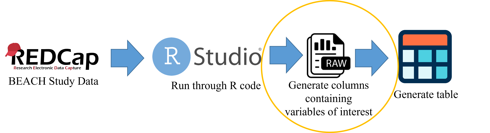

```{r, include=FALSE}
##-------------- 
# **************************************************************************** #
# ***************                Project Overview              *************** #
# **************************************************************************** #

# Author:            Dominick J. Lemas
# Start Date:        07/19/2022 
# Date Modify:       2/14/2023
# Project:           The Breastfeeding and EArly Child Health Study
# IRB:               IRB201601034
#                   
#
# version: R version 4.0.2 (2020-06-22)
# version: Rstudio version Version 1.3.959 

# **************************************************************************** #
# ***************                Description                   *************** #
# **************************************************************************** #

# NOTE: This script consumes data that was generated by 

# PLAN: Format data for downstream reports NIH Enrollment Report

project_name="The Breastfeeding and EArly Child Health Study"
irb_number="IRB201601034"
upstream_code="~/code/get/get_RedCapData_21221.Rmd"
report_id<-36804L
report_name= "BEACH Study Overview"
input_file="report_36804.RData"

```


```{r, message=FALSE,echo=FALSE,include=FALSE}

# **************************************************************************** #
# ***************                Library                       *************** #
# **************************************************************************** #

#library(readxl)
library(tidyverse)
library(dplyr)
library(ggplot2)
library(eeptools)
# source("~/BEACH-reports/code/utils/utils.R")

```

```{r, message=FALSE,include=FALSE}

# **************************************************************************** #
# ***************              Load/Trim Data                  *************** #
# **************************************************************************** #

load("~/BEACH-reports/data/raw/report_36804.RData")

#select out extra data
df <- report %>% select(test_id, maternal_study_groups, beach_final_bmi,inf2wk_gest_age, mom3t_birth_date, mom2wk_delivery_date, inf2mo_bfpump_age_stop, inf2mo_bfpump_age_stop_units )

#create one row for each participant with their respective data
participants <- df %>%
  group_by(test_id) %>%
  fill(everything(), .direction = "down") %>%
  fill(everything(), .direction = "up") %>%
  slice(1)


#renaming column headings
names(participants)[names(participants) == "maternal_study_groups"] <- "BMI_Group"
names(participants)[names(participants) == "beach_final_bmi"] <- "BMI"
names(participants)[names(participants) == "inf2wk_gest_age"] <- "Gestational_Age"


#coding some of the values for study groups and breastfeeding units
bmi_recode <- participants %>%
    mutate(BMI_Group = recode(BMI_Group, "1" = 'NW', "2" = 'OW', "3" =  'OB' ))
months_recode <- bmi_recode %>%
    mutate(inf2mo_bfpump_age_stop_units = recode(inf2mo_bfpump_age_stop_units, "1" = 'Weeks', "2" = "Months"))

```

```{r, message=FALSE, include=FALSE}
# **************************************************************************** #
# ***************      Changing Specific Breastfeeding Data    *************** #
# **************************************************************************** #

#cleaning data for specific values that have specific inconsistencies for easier analysis

#changing row 44 column 7-8, BLS056A, from 3 weeks to 1.5 months as it's the only data listed in weeks
#and the value for inf2mo_bf_pump_age_stop is listed as 6 weeks for their 6 month and 12 month visits
months_recode[44,7] = "1.5"
months_recode[44,8] = "months"

#chaning row 54 column 7, BLS070A inf2mo_bfpump_age_stop, from "9 1/2" to "9.5"
months_recode[54,7] = "9.5"

#changing row 58 column 7, BLS078A inf2mo_bfpump_age_stop, from "5-6" to "5.5," to provide an average of the range for an easier numerical value for analysis
months_recode[58,7] = "5.5"

#since all data is now in months, renaming column to just be in months and removing units column
names(months_recode)[names(months_recode) == "inf2mo_bfpump_age_stop"] <- "Breastfeeding_Months"
age_calculate <- months_recode %>% select(BMI_Group, BMI, Gestational_Age, mom3t_birth_date, mom2wk_delivery_date, Breastfeeding_Months)


```

```{r, message=FALSE, include=FALSE}
# **************************************************************************** #
# ***************                Calculating Age               *************** #
# **************************************************************************** #

#ensure ggplot2 and eeptools are downloaded

age_calculate$Age <- floor(age_calc(na.omit(age_calculate$mom3t_birth_date), na.omit(age_calculate$mom2wk_delivery_date)))
age_calculate$Age[!is.na(age_calculate$mom2wk_delivery_date)] <- age_calculate$Age


```

age_calculate$Age <- function(age_calc, na.rm){ 
  age_calc(age_calculate$mom3t_birth_date,enddate = age_calculate$mom2wk_delivery_date)}

age_calc(age_calculate$mom3t_birth_date, enddate = age_calculate$mom2wk_delivery_date, units = "years")

age_calculate$Age <- floor(age_calc(age_calculate$mom3t_birth_date,enddate = age_calculate$mom2wk_delivery_date))
#age_calculate$Age_month <- floor(age_calc(age_calculate$mom3t_birth_date, units = "months"))


```

```{r, message=FALSE,include=FALSE}

# **************************************************************************** #
# ***************              Save Data Local                 *************** #
# **************************************************************************** #

# Save the data in your local laptop (Github path: /data)
save(list=c("participants"),file="~/BEACH-reports/data/processed/36804_BEACHTable1_clean.RData")

output_directory="~/BEACH-reports/data/processed/"
output_file_name="BEACHTable1.RData"

```


#### __Project Details__
Title: `r project_name`  
IRB Number: `r irb_number`  
Report Name (source-data): `r report_name`  
Report ID (source-data): `r report_id`  
Upstream Code: `r upstream_code`  
Input Data: `r input_file`

#### __Data Processing Summary__
Data is added to RedCap and then run through the upstream code `r upstream_code` which extracts specific variables of interest and saves in `r input_file`. Then the data runs through this code to generate columns of raw data and saved in `r output_file_name` to be processed into a table.


#### __Data Description__


```{r, message=FALSE, echo=FALSE}


```
  
#### __Project Outputs__  
Output Directory: `r output_directory`  
Output File Name: `r output_file_name`


