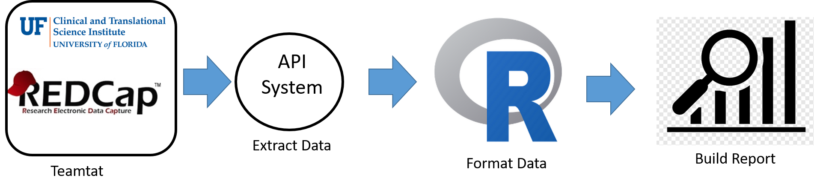

```{r, include=FALSE}
##-------------- 
# **************************************************************************** #
# ***************                Project Overview              *************** #
# **************************************************************************** #

# Author:            Dominick J. Lemas
# Start Date:        04/15/2023 
# Date Modify:       
# Project:           The Breastfeeding and EArly Child Health Study
# IRB:               IRB201601034
#                   
#
# R version 4.2.1 (2022-06-23 ucrt) -- "Funny-Looking Kid"
# Copyright (C) 2022 The R Foundation for Statistical Computing
# Platform: x86_64-w64-mingw32/x64 (64-bit)

# **************************************************************************** #
# ***************                Description                   *************** #
# **************************************************************************** #

# PLAN: Access redcap via API and fetch/format/ready data for downstream analysis.
# Note: vpn must be active

# keyringr must be installed: https://cran.r-project.org/web/packages/keyringr/vignettes/Avoiding_plain_text_passwords_in_R_with_keyringr.html

project_name="The Breastfeeding and EArly Child Health Study"
irb_number="IRB201601034"

```

```{r, message=FALSE, include=FALSE}

# **************************************************************************** #
# ***************                Library                       *************** #
# **************************************************************************** #

library(keyringr)
library(redcapAPI)
library(REDCapR)
library(tidyverse)
source("~/plasma-metabolomics/code/utils/utils.R")


```

```{r, message=FALSE,include=FALSE}

# **************************************************************************** #
# ***************              Extract Data                    *************** #
# **************************************************************************** #

# API & URL
#----------
uri <- "https://redcap.ctsi.ufl.edu/redcap/api/"
api_token=get_API_token("beach_api")

# REPORT IDS
#-----------

# Study Overview
report_id<-39840L
report_name= "Plasma Metabolomics and Maternal-Infant Outcomes"


# PULL DATA
#-----------
report_raw <-
  REDCapR::redcap_report(
    redcap_uri = uri,
    token      = api_token,
    report_id  = report_id
  )$data 

# plasma
plasma = report_raw %>%
   select(test_id,metabolite_name,metabolite_units,metabolite_value) %>% drop_na()

# maternal outcomes
maternal = report_raw %>%
   select(test_id,beach_final_bmi,maternal_study_groups,mom_ethnicity_nih,
          maternal_race_nih___1,maternal_race_nih___2,maternal_race_nih___3,
          maternal_race_nih___4,maternal_race_nih___5,maternal_race_nih___6) 

# infant outcomes
infant = report_raw %>%
   select(test_id,infant_ethnicity_nih,
          infant_race_nih___1,infant_race_nih___2,infant_race_nih___3,
          infant_race_nih___4,infant_race_nih___5,infant_race_nih___6,
          infant_crc_wt_kg,wt_zscore,inf2wk_gest_age,inf2wk_sex) 

```
```{r, message=FALSE,include=FALSE}

# **************************************************************************** #
# ***************              Save Data Local                 *************** #
# **************************************************************************** #

# Save the data in your local laptop (Github path: /data)
save(list=c("report"),file="~/BEACH-reports/data/raw/report_21221.RData")

output_directory="~/BEACH-reports/data/raw/"
output_file_name="report_21221.RData"

```

#### __Project Details__
Title: `r project_name`  
IRB Number: `r irb_number`  
Redcap URL: `r uri`  
Report Name: `r report_name`  
Report ID: `r report_id`

#### __Data Processing Summary__
Variables of interest are stored as RedCap reports. Data is extracted from REdcap via REDCapR using URL and API token. The extracted data is lightly formatted and output as an *.rda object for downstream analysis.  


#### __Data Description__

```{r, message=FALSE, echo=FALSE}

part_length=unique(length(report$test_id))
hist(report$beach_final_bmi)

```
  
#### __Project Outputs__  
Output Directory: `r output_directory`  
Output File Name: `r output_file_name`