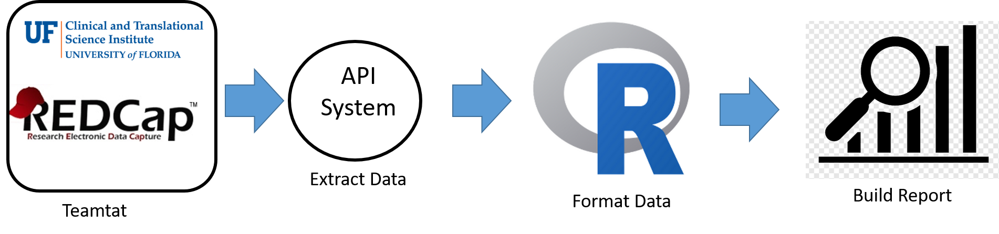

```{r, include=FALSE}
##-------------- 
# **************************************************************************** #
# ***************                Project Overview              *************** #
# **************************************************************************** #

# Author:            Dominick J. Lemas
# Start Date:        07/19/2022 
# Date Modify:       2/14/2023
# Project:           The Breastfeeding and EArly Child Health Study
# IRB:               IRB201601034
#                   
#
# version: R version 4.0.2 (2020-06-22)
# version: Rstudio version Version 1.3.959 

# **************************************************************************** #
# ***************                Description                   *************** #
# **************************************************************************** #

# PLAN: Access redcap via API and pull/format/clean data for downstream analysis.
# Note: vpn must be active

# keyringr must be installed: https://cran.r-project.org/web/packages/keyringr/vignettes/Avoiding_plain_text_passwords_in_R_with_keyringr.html

project_name="The Breastfeeding and EArly Child Health Study"
irb_number="IRB201601034"

```

```{r, message=FALSE, include=FALSE}

# **************************************************************************** #
# ***************                Library                       *************** #
# **************************************************************************** #

library(keyringr)
library(redcapAPI)
library(REDCapR)
library(tidyverse)
# library(ezknitr)
source("~/BEACH-reports/code/utils/utils.R")

```

```{r, message=FALSE,include=FALSE}

# **************************************************************************** #
# ***************              Extract Data                    *************** #
# **************************************************************************** #

# API & URL
#----------
uri <- "https://redcap.ctsi.ufl.edu/redcap/api/"
api_token=get_API_token("beach_api")

# REPORT IDS
#-----------

# Study Overview
report_id<-36804L
report_name= "BEACH Table 1"


# PULL DATA
#-----------
report_raw <-
  REDCapR::redcap_report(
    redcap_uri = uri,
    token      = api_token,
    report_id  = report_id
  )$data 

report = report_raw %>%
  select(-redcap_repeat_instrument,-redcap_repeat_instance, -redcap_survey_identifier, -health_update_3rd_trimester_v5082518_timestamp)   # drop out variables not needed)

```

```{r, message=FALSE,include=FALSE}

# **************************************************************************** #
# ***************              Save Data Local                 *************** #
# **************************************************************************** #

# Save the data in your local laptop (Github path: /data)
save(list=c("report"),file="~/BEACH-reports/data/raw/report_36804.RData")

output_directory="~/BEACH-reports/data/raw/"
output_file_name="report_36804.RData"

```

#### __Project Details__
Title: `r project_name`  
IRB Number: `r irb_number`  
Redcap URL: `r uri`  
Report Name: `r report_name`  
Report ID: `r report_id`

#### __Data Processing Summary__
Variables of interest are stored as RedCap reports. Data is extracted from REdcap via REDCapR using URL and API token. The extracted data is lightly formatted and output as an *.rda object for downstream analysis.  
