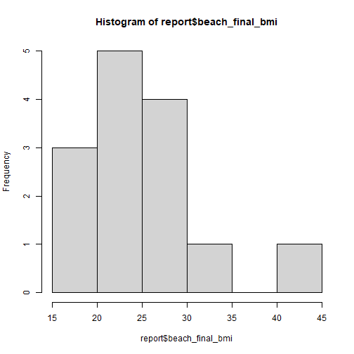

#### __Project Details__
Title: The Breastfeeding and EArly Child Health Study  
IRB Number: IRB201601034  
Redcap URL: https://redcap.ctsi.ufl.edu/redcap/api/  
Report Name: BEACH Study Overview  
Report ID: 21221

#### __Data Processing Summary__
Variables of interest are stored as RedCap reports. Data is extracted from REdcap via REDCapR using URL and API token. The extracted data is lightly formatted and output as an *.rda object for downstream analysis.  

#### __Data Description__

  
#### __Project Outputs__  
Output Directory: ~/BEACH-reports/data/raw/  
Output File Name: report_21221.RData
